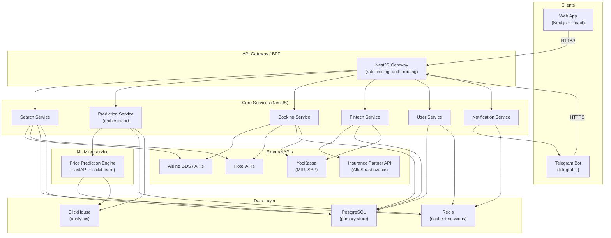
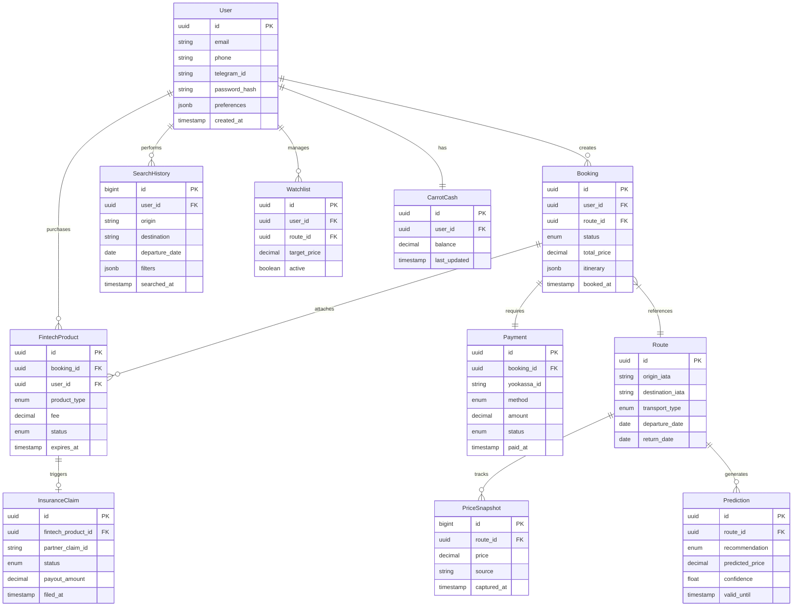
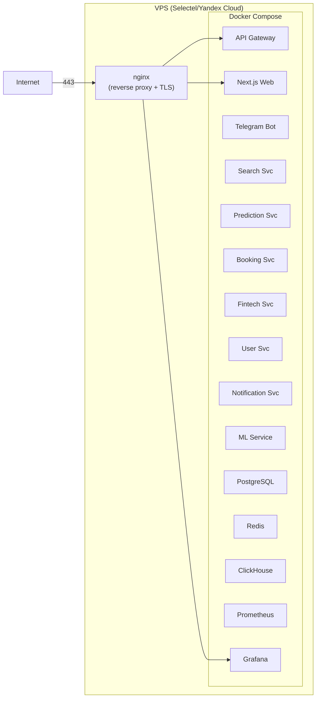

# Architecture Document: HopperRU
**Version:** 1.0 | **Date:** 2026-05-12 | **Status:** Draft

---

## 1. Architecture Style

**Distributed Monolith in a Monorepo.** All services live in a single repository and are deployed as a coordinated set of Docker containers via Docker Compose. Services communicate over an internal Docker network using HTTP/gRPC. This approach balances startup velocity (shared tooling, single CI pipeline) with clear service boundaries that can be extracted to true microservices in Phase 2 when traffic warrants it.

---

## 2. High-Level System Diagram

---

## 3. Component Breakdown

### 3.1 API Gateway / BFF (NestJS)

| Responsibility | Details |
|----------------|---------|
| Authentication | JWT validation, token refresh, Telegram auth widget |
| Rate limiting | Per-user and per-IP throttling (Redis-backed) |
| Request routing | Proxy to internal services via HTTP |
| Response aggregation | Combine data from multiple services for client views |
| Input validation | DTO validation via class-validator |
| Logging & tracing | Correlation IDs, structured JSON logs |

### 3.2 Search Service

| Responsibility | Details |
|----------------|---------|
| Flight search | Query airline GDS/APIs, normalize results |
| Hotel search | Query hotel APIs, normalize results |
| Result caching | Cache popular route results in Redis (TTL 5-15 min) |
| Filter & sort | Price, duration, stops, departure time |
| Search history | Persist user searches in PostgreSQL for prediction training |

### 3.3 Prediction Service (Orchestrator)

| Responsibility | Details |
|----------------|---------|
| Price trend analysis | Request ML microservice for route-specific predictions |
| Buy/wait recommendation | Generate "Buy Now" / "Wait N days" signals |
| Confidence scoring | Map ML output to user-facing confidence levels |
| Historical data feed | Stream search data to ClickHouse for ML training |
| Fallback logic | Rule-based predictions when ML model unavailable |

### 3.4 ML Microservice (FastAPI + Python)

| Responsibility | Details |
|----------------|---------|
| Price prediction model | Phase 1: scikit-learn (gradient boosting) on rule-based features |
| Model serving | REST API for real-time inference |
| Training pipeline | Batch training from ClickHouse data (daily cron) |
| Feature engineering | Seasonality, day-of-week, advance purchase, route popularity |
| Phase 2 migration | TensorFlow LSTM for time-series prediction |

### 3.5 Booking Service

| Responsibility | Details |
|----------------|---------|
| Reservation creation | Create PNR via airline/hotel APIs |
| Payment orchestration | Initiate payment via YooKassa (MIR, SBP, bank cards) |
| Booking state machine | Draft -> Pending Payment -> Confirmed -> Completed / Cancelled |
| Itinerary management | Store booking details, generate e-tickets |
| Concurrent booking guard | Optimistic locking to prevent double-booking |

### 3.6 Fintech Service

| Responsibility | Details |
|----------------|---------|
| Price Freeze | Lock price for up to 21 days, charge flat fee |
| Cancel For Any Reason | Full refund insurance via partner, percentage-based fee |
| Price Drop Protection | Monitor price 10 days post-booking, refund difference |
| Flight Disruption Guarantee | Auto-rebook on delays 2h+, partner-insured |
| Actuarial pricing | Dynamic fee calculation based on route risk profile |
| Insurance API integration | Claims submission and settlement with insurance partner |

### 3.7 User Service

| Responsibility | Details |
|----------------|---------|
| Registration/login | Email + password, Telegram OAuth, phone (SMS OTP) |
| Profile management | Personal data, travel preferences, saved payment methods |
| Session management | JWT tokens with Redis session store |
| Watchlist | Saved routes with price alert thresholds |
| Carrot Cash | In-app cashback balance, earned per booking |

### 3.8 Notification Service

| Responsibility | Details |
|----------------|---------|
| Telegram push | Price alerts, booking confirmations, disruption notices |
| Email transactional | Booking receipts, e-tickets, password reset |
| In-app notifications | WebSocket-based real-time updates |
| Scheduling | Cron-based weekly digest ("3 routes in your watchlist changed") |

---

## 4. Technology Stack

| Layer | Technology | Version | Rationale |
|-------|-----------|---------|-----------|
| **Frontend** | Next.js + React | 14.x / 18.x | SSR for SEO (landing pages), ISR for travel content |
| **Telegram Bot** | telegraf.js | 4.x | Most mature Node.js Telegram framework, inline keyboards |
| **API Server** | NestJS (TypeScript) | 10.x | Enterprise patterns (DI, modules, guards), strong typing |
| **ML Service** | FastAPI (Python) | 0.110+ | Async, auto-docs, native ML library ecosystem |
| **ML Framework** | scikit-learn -> TensorFlow | 1.4 / 2.16 | Phase 1: fast iteration; Phase 2: deep learning |
| **Primary DB** | PostgreSQL | 16 | ACID transactions, JSONB for flexible schemas, mature |
| **Cache** | Redis | 7.x | Sub-millisecond reads, pub/sub for real-time notifications |
| **Analytics** | ClickHouse | 24.x | Columnar storage, 100x faster aggregations than PG for analytics |
| **ORM** | Prisma | 5.x | Type-safe DB access, migrations, introspection |
| **Message Queue** | BullMQ (Redis) | 5.x | Job queues for async tasks (email, training, price monitoring) |
| **Payments** | YooKassa SDK | latest | Only option for MIR + SBP in Russia, well-documented |
| **Containerization** | Docker + Docker Compose | 24.x / 2.x | Reproducible builds, single-command deploy |
| **CI/CD** | GitHub Actions | — | Free tier sufficient, native Docker support |
| **Monitoring** | Prometheus + Grafana | — | Industry standard, extensive NestJS/FastAPI exporters |
| **Logging** | Pino (Node) + structlog (Python) | — | Structured JSON logs, low overhead |
| **Hosting** | Selectel / Yandex Cloud VPS | — | 152-FZ compliant, RU data residency |

---

## 5. Data Architecture

### 5.1 Core Entities

### 5.2 Storage Strategy

| Data Type | Store | Rationale |
|-----------|-------|-----------|
| User profiles, bookings, payments | PostgreSQL | ACID, relational integrity, GDPR-style deletion |
| Price snapshots (recent 30 days) | PostgreSQL | Transactional queries, JOIN with routes |
| Price snapshots (historical) | ClickHouse | Billions of rows, columnar aggregation for ML training |
| Search results cache | Redis (TTL 5-15 min) | Sub-ms latency, automatic expiry |
| Session tokens | Redis | Fast lookup, automatic expiry |
| Rate limit counters | Redis | Atomic increments, TTL-based windows |
| User search history (analytics) | ClickHouse | Funnel analysis, conversion tracking |
| ML training datasets | ClickHouse -> Parquet export | Batch processing for model training |

### 5.3 Data Flow

1. **Ingestion:** Search requests trigger airline/hotel API calls; raw prices stored in PG + streamed to ClickHouse via BullMQ worker
2. **Training:** Daily cron exports ClickHouse data to Parquet, triggers ML training pipeline
3. **Inference:** Real-time prediction requests hit FastAPI, which loads the latest model from disk
4. **Analytics:** All user events (search, click, book, fintech purchase) streamed to ClickHouse via async BullMQ jobs

---

## 6. Security Architecture

### 6.1 152-FZ Compliance

| Requirement | Implementation |
|-------------|---------------|
| Data residency in RF | All servers hosted on Selectel/Yandex Cloud (Moscow region) |
| Personal data processing consent | Explicit opt-in checkbox at registration, stored with timestamp |
| Right to deletion | `DELETE /api/users/me` triggers cascading soft-delete, hard-delete after 30 days |
| Data processing registry | Registered with Roskomnadzor before launch |
| Cross-border transfer | Prohibited by default; if needed, explicit consent + adequacy check |
| Data breach notification | Automated alerting to DPO within 24 hours |

### 6.2 Authentication & Authorization

| Layer | Mechanism |
|-------|-----------|
| User auth | JWT access tokens (15 min TTL) + refresh tokens (7 day TTL, rotated) |
| Telegram auth | Telegram Login Widget hash verification |
| API auth | Bearer token in Authorization header |
| Service-to-service | Internal network isolation (Docker network) + API keys for ML service |
| Role-based access | User, Admin roles via JWT claims |
| Rate limiting | 100 req/min per user, 20 req/min unauthenticated |

### 6.3 Data Encryption

| Scope | Method |
|-------|--------|
| In transit | TLS 1.3 (nginx reverse proxy termination) |
| At rest (DB) | PostgreSQL TDE or volume-level encryption (LUKS) |
| At rest (backups) | AES-256 encrypted backups |
| Sensitive fields | Application-level encryption for payment tokens, passport data |
| Secrets management | Docker secrets + environment variables (never in code/repo) |

### 6.4 OWASP Top 10 Mitigations

| Threat | Mitigation |
|--------|-----------|
| Injection (SQL, NoSQL) | Prisma parameterized queries, input validation via class-validator |
| Broken Authentication | JWT with short TTL, refresh rotation, bcrypt password hashing |
| Sensitive Data Exposure | TLS everywhere, encrypted PII, masked logs |
| XXE | No XML parsing; JSON-only APIs |
| Broken Access Control | Guard-based RBAC in NestJS, resource ownership checks |
| Security Misconfiguration | Hardened Docker images (non-root), security headers (helmet) |
| XSS | React auto-escaping, CSP headers, sanitize-html for user input |
| Insecure Deserialization | class-transformer whitelisting, no eval/pickle |
| Known Vulnerabilities | Dependabot + npm audit in CI |
| Insufficient Logging | Structured logging of all auth events, anomaly detection |

---

## 7. Scalability Strategy

### 7.1 Horizontal Scaling

| Component | Scaling Method | Trigger |
|-----------|---------------|---------|
| API Gateway | Docker replicas behind nginx load balancer | CPU > 70% or p99 > 500ms |
| Search Service | Horizontal replicas (stateless) | Request queue depth > 100 |
| ML Service | Horizontal replicas (model loaded at startup) | Inference latency > 200ms |
| PostgreSQL | Read replicas for search queries | Read IOPS > 80% capacity |
| Redis | Redis Sentinel for HA, Cluster for sharding | Memory > 80% |
| ClickHouse | Add shards for data volume growth | Storage > 70% |

### 7.2 Caching Strategy

| Cache Layer | TTL | Content |
|-------------|-----|---------|
| CDN (Cloudflare) | 1h | Static assets, landing pages |
| Redis L1 | 5-15 min | Search results for popular routes |
| Redis L2 | 1h | Prediction results per route+date |
| Application | Request-scoped | Aggregated API responses |
| Browser | 24h | Static JS/CSS bundles (hashed filenames) |

### 7.3 Performance Targets

| Metric | Target (p95) |
|--------|-------------|
| Search API response | < 2s |
| Prediction API response | < 500ms |
| Booking creation | < 3s |
| Telegram bot response | < 1s |
| Web page load (LCP) | < 2.5s |
| ML inference | < 100ms |

---

## 8. Integration Architecture

### 8.1 External API Integrations

| Integration | Protocol | Auth | Rate Limit | Fallback |
|-------------|----------|------|-----------|----------|
| Airline GDS (Amadeus/Sabre) | REST/SOAP | API Key + OAuth2 | 100 TPS | Cached results + error page |
| Hotel APIs (aggregator) | REST | API Key | 50 TPS | Cached results |
| YooKassa | REST | Shop ID + Secret Key | 300 req/min | Payment retry queue |
| Insurance Partner | REST | mTLS + API Key | 10 TPS | Manual claim processing |
| Telegram Bot API | HTTPS (webhooks) | Bot Token | 30 msg/sec | Polling fallback |

### 8.2 MCP Server Integration

MCP (Model Context Protocol) servers provide AI capabilities:

| MCP Server | Purpose | Connected Service |
|------------|---------|-------------------|
| Price Analysis MCP | Natural language price queries ("When is cheapest to fly to Sochi?") | Prediction Service |
| Booking Assistant MCP | Conversational booking flow in Telegram | Telegram Bot |
| Support MCP | Automated customer service for booking changes | Notification Service |

### 8.3 Webhook Architecture

| Event | Source | Consumer | Purpose |
|-------|--------|----------|---------|
| Payment status change | YooKassa | Booking Service | Confirm/cancel booking on payment success/failure |
| Insurance claim update | Insurance Partner | Fintech Service | Update claim status, trigger payout |
| Price alert trigger | Price Monitor (cron) | Notification Service | Notify users when watched route price changes |
| Booking status change | Booking Service | Notification Service | Send confirmations, reminders |

---

## 9. Deployment Architecture

**Key deployment decisions:**
- Single VPS for MVP (4 vCPU, 16GB RAM, 200GB SSD) -- approximately ₽15,000/month on Selectel
- nginx as reverse proxy with Let's Encrypt TLS
- All containers on a single Docker Compose stack with health checks
- Volume mounts for persistent data (PG, Redis, ClickHouse)
- Automated backups to Selectel S3-compatible storage (daily)

---

## 10. Cross-Cutting Concerns

| Concern | Implementation |
|---------|---------------|
| **Logging** | Structured JSON via Pino (Node) and structlog (Python), centralized via Docker log driver |
| **Tracing** | Correlation ID propagated via `X-Request-ID` header across all services |
| **Health checks** | `/health` endpoint on every service, checked by Docker and Prometheus |
| **Configuration** | Environment variables via `.env` files, Docker secrets for sensitive values |
| **Error handling** | NestJS global exception filter, FastAPI exception handlers, standardized error response format |
| **API versioning** | URL-based (`/api/v1/`) for external APIs, header-based for internal |
| **Feature flags** | Simple Redis-backed flag store for A/B testing and gradual rollout |
