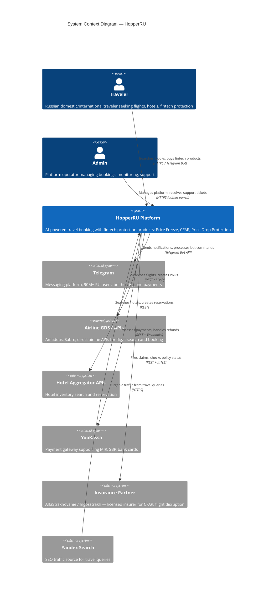
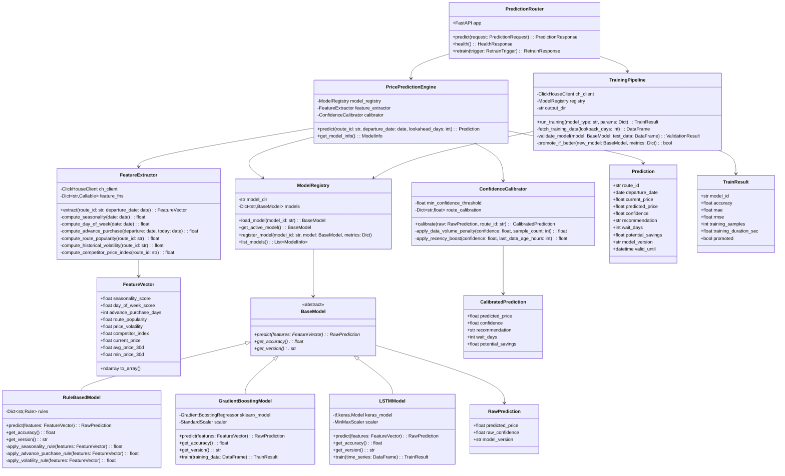

# C4 Diagrams: HopperRU
**Version:** 1.0 | **Date:** 2026-05-12 | **Status:** Draft

---

## Level 1: System Context

Shows HopperRU and all external actors it interacts with.



---

## Level 2: Container Diagram

Breaks down the HopperRU system into deployable containers.

```mermaid
C4Container
    title Container Diagram — HopperRU

    Person(traveler, "Traveler")

    System_Boundary(hopperru, "HopperRU Platform") {
        Container(web, "Web Application", "Next.js + React", "SSR/ISR pages for search, booking, account management. Responsive design.")
        Container(tgbot, "Telegram Bot", "Node.js + telegraf.js", "Conversational booking flow via inline keyboards. Price alerts and notifications.")
        Container(gateway, "API Gateway", "NestJS", "Authentication, rate limiting, request routing, response aggregation.")
        Container(search, "Search Service", "NestJS", "Flight and hotel search via external APIs. Result normalization and caching.")
        Container(prediction, "Prediction Service", "NestJS", "Orchestrates price predictions. Manages fallback from ML to rules.")
        Container(booking, "Booking Service", "NestJS", "Reservation lifecycle, payment orchestration via YooKassa, ticketing.")
        Container(fintech, "Fintech Service", "NestJS", "Price Freeze, CFAR, Price Drop Protection, Disruption Guarantee. Insurance partner integration.")
        Container(user, "User Service", "NestJS", "Authentication (JWT), profile management, watchlists, Carrot Cash.")
        Container(notification, "Notification Service", "NestJS", "Telegram push, email transactional, scheduled digests, WebSocket real-time.")
        Container(ml, "ML Service", "Python + FastAPI", "Price prediction model (scikit-learn Phase 1, TensorFlow Phase 2). Training pipeline.")

        ContainerDb(pg, "PostgreSQL", "PostgreSQL 16", "Users, bookings, payments, fintech products, routes. ACID transactional store.")
        ContainerDb(redis, "Redis", "Redis 7", "Search result cache, session store, rate limit counters, feature flags, BullMQ job queue.")
        ContainerDb(ch, "ClickHouse", "ClickHouse", "Historical price snapshots (billions of rows), search analytics, ML training data.")
    end

    System_Ext(airlines, "Airline APIs")
    System_Ext(hotels, "Hotel APIs")
    System_Ext(yookassa, "YooKassa")
    System_Ext(insurance, "Insurance Partner")
    System_Ext(telegram_api, "Telegram Bot API")

    Rel(traveler, web, "Uses", "HTTPS")
    Rel(traveler, tgbot, "Uses", "Telegram")

    Rel(web, gateway, "API calls", "HTTPS/JSON")
    Rel(tgbot, gateway, "API calls", "HTTP/JSON")

    Rel(gateway, search, "Routes search requests", "HTTP")
    Rel(gateway, prediction, "Routes prediction requests", "HTTP")
    Rel(gateway, booking, "Routes booking requests", "HTTP")
    Rel(gateway, fintech, "Routes fintech requests", "HTTP")
    Rel(gateway, user, "Routes auth/profile requests", "HTTP")
    Rel(gateway, notification, "Routes notification requests", "HTTP")

    Rel(search, airlines, "Queries flights", "REST/SOAP")
    Rel(search, hotels, "Queries hotels", "REST")
    Rel(search, redis, "Caches results", "Redis protocol")
    Rel(search, pg, "Stores search metadata", "TCP/SQL")

    Rel(prediction, ml, "Requests inference", "HTTP/JSON")
    Rel(prediction, redis, "Caches predictions", "Redis protocol")
    Rel(prediction, ch, "Reads historical data", "HTTP/SQL")

    Rel(booking, yookassa, "Processes payments", "REST + Webhooks")
    Rel(booking, airlines, "Creates PNRs", "REST/SOAP")
    Rel(booking, pg, "Stores bookings", "TCP/SQL")

    Rel(fintech, insurance, "Files claims", "REST + mTLS")
    Rel(fintech, pg, "Stores fintech products", "TCP/SQL")

    Rel(user, pg, "Stores user data", "TCP/SQL")
    Rel(user, redis, "Manages sessions", "Redis protocol")

    Rel(notification, telegram_api, "Sends messages", "HTTPS")
    Rel(notification, redis, "Job queue", "Redis protocol")

    Rel(ml, pg, "Reads route data", "TCP/SQL")
    Rel(ml, ch, "Reads training data", "HTTP/SQL")
```

---

## Level 3: Component Diagram — API Server (Gateway + Core Modules)

Breaks down the API Gateway and shows how NestJS modules interact.

```mermaid
C4Component
    title Component Diagram — API Gateway & Core Service Modules

    Container_Boundary(gateway, "API Gateway (NestJS)") {
        Component(auth_guard, "AuthGuard", "NestJS Guard", "Validates JWT tokens, extracts user context. Handles Telegram auth widget verification.")
        Component(rate_limiter, "RateLimiter", "NestJS Guard + Redis", "Per-user and per-IP throttling. Sliding window counter in Redis.")
        Component(router, "RequestRouter", "NestJS Controller", "Routes incoming requests to appropriate downstream service based on path prefix.")
        Component(aggregator, "ResponseAggregator", "NestJS Interceptor", "Combines responses from multiple services for dashboard/summary endpoints.")
        Component(validator, "InputValidator", "class-validator + class-transformer", "DTO validation, type coercion, sanitization for all incoming requests.")
        Component(error_handler, "GlobalExceptionFilter", "NestJS Filter", "Catches all exceptions, formats standardized error responses, logs errors.")
        Component(cors, "CorsMiddleware", "NestJS Middleware", "Whitelist-based CORS for web app and Telegram domains.")
    end

    Container_Boundary(auth_module, "AuthModule (User Service)") {
        Component(auth_controller, "AuthController", "NestJS Controller", "POST /auth/login, /auth/register, /auth/refresh, /auth/telegram")
        Component(auth_service, "AuthService", "NestJS Service", "Password hashing (bcrypt), JWT generation/validation, Telegram hash verification")
        Component(user_repo, "UserRepository", "Prisma", "CRUD operations on User entity, profile updates, account linking")
        Component(session_store, "SessionStore", "Redis", "Stores refresh tokens, manages token rotation and revocation")
    end

    Container_Boundary(search_module, "SearchModule") {
        Component(search_controller, "SearchController", "NestJS Controller", "GET /search/flights, /search/hotels with query parameters")
        Component(search_service, "SearchService", "NestJS Service", "Orchestrates multi-provider search, normalizes results, applies filters/sort")
        Component(airline_adapter, "AirlineAdapter", "NestJS Provider", "Adapts Amadeus/Sabre/direct API responses to internal flight model")
        Component(hotel_adapter, "HotelAdapter", "NestJS Provider", "Adapts hotel aggregator responses to internal hotel model")
        Component(search_cache, "SearchCache", "Redis", "Caches search results by route+date+filters hash, TTL 5-15 min")
    end

    Container_Boundary(prediction_module, "PredictionModule") {
        Component(pred_controller, "PredictionController", "NestJS Controller", "GET /predict/:routeId with date range")
        Component(pred_service, "PredictionService", "NestJS Service", "Calls ML service for inference, falls back to RuleEngine if unavailable")
        Component(rule_engine, "RuleEngine", "NestJS Provider", "Seasonality + day-of-week + advance-purchase heuristics for Phase 1 predictions")
        Component(ml_client, "MLServiceClient", "HTTP Client", "REST client to FastAPI ML microservice with circuit breaker")
    end

    Container_Boundary(booking_module, "BookingModule") {
        Component(book_controller, "BookingController", "NestJS Controller", "POST /bookings, GET /bookings/:id, PATCH /bookings/:id/cancel")
        Component(book_service, "BookingService", "NestJS Service", "Booking state machine: Draft -> Pending -> Confirmed -> Completed/Cancelled")
        Component(payment_service, "PaymentService", "NestJS Service", "YooKassa payment creation, webhook handling, idempotency, refund processing")
        Component(ticket_service, "TicketService", "NestJS Service", "PNR creation via airline API, e-ticket generation, itinerary storage")
    end

    Container_Boundary(fintech_module, "FintechModule") {
        Component(fintech_controller, "FintechController", "NestJS Controller", "POST /fintech/freeze, /fintech/cfar, /fintech/pdp, GET /fintech/:bookingId")
        Component(freeze_service, "PriceFreezeService", "NestJS Service", "Creates freeze, monitors expiry, applies frozen price at checkout")
        Component(cfar_service, "CFARService", "NestJS Service", "Creates CFAR policy via insurance partner, processes cancellation claims")
        Component(pdp_service, "PriceDropService", "NestJS Service", "Monitors price for 10 days post-booking, triggers automatic refund on drop")
        Component(insurance_client, "InsuranceClient", "HTTP Client", "REST + mTLS client to insurance partner API")
    end

    Container_Boundary(notification_module, "NotificationModule") {
        Component(notif_controller, "NotificationController", "NestJS Controller", "Internal API for triggering notifications from other services")
        Component(notif_service, "NotificationService", "NestJS Service", "Routes notifications to appropriate channel (Telegram, email, WebSocket)")
        Component(telegram_sender, "TelegramSender", "NestJS Provider", "Formats and sends Telegram messages via Bot API")
        Component(email_sender, "EmailSender", "NestJS Provider", "Transactional emails via SMTP (booking confirmations, receipts)")
        Component(scheduler, "NotificationScheduler", "BullMQ", "Cron-based jobs: weekly digest, price alert checks, freeze expiry reminders")
    end

    Rel(router, auth_guard, "Checks auth")
    Rel(router, rate_limiter, "Checks rate limit")
    Rel(router, validator, "Validates input")
    Rel(router, auth_controller, "/auth/*")
    Rel(router, search_controller, "/search/*")
    Rel(router, pred_controller, "/predict/*")
    Rel(router, book_controller, "/bookings/*")
    Rel(router, fintech_controller, "/fintech/*")
    Rel(router, notif_controller, "/notifications/*")
```

---

## Level 4: Code — PricePredictionEngine

Class diagram for the ML service's core prediction logic.



### Class Responsibilities

| Class | Responsibility |
|-------|---------------|
| `PredictionRouter` | FastAPI endpoint handler. Validates requests, delegates to engine, serializes responses. |
| `PricePredictionEngine` | Core orchestrator. Extracts features, selects model, runs inference, calibrates confidence. |
| `FeatureExtractor` | Computes ML features from raw data. Queries ClickHouse for historical prices, computes derived metrics. |
| `FeatureVector` | Immutable data class holding all features for a single prediction request. |
| `ModelRegistry` | Manages model lifecycle: loading from disk, versioning, A/B selection of active model. |
| `BaseModel` | Abstract base class defining the prediction interface. All models implement `predict()`. |
| `RuleBasedModel` | Phase 1 model. Hand-crafted rules for seasonality, advance purchase, volatility. Target: 70% accuracy. |
| `GradientBoostingModel` | Phase 2 model. scikit-learn gradient boosting trained on accumulated price data. Target: 85% accuracy. |
| `LSTMModel` | Phase 3 model. TensorFlow LSTM for time-series price prediction. Target: 95% accuracy. |
| `ConfidenceCalibrator` | Post-processes raw model confidence. Applies penalties for low data volume, boosts for fresh data. |
| `TrainingPipeline` | Batch training orchestrator. Fetches data, trains model, validates, promotes if metrics improve. |
