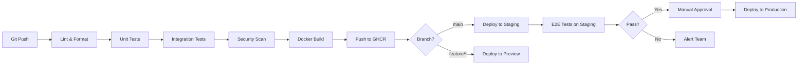

# Completion Document: HopperRU
**Version:** 1.0 | **Date:** 2026-05-12 | **Status:** Draft

---

## 1. Pre-Launch Checklist (MVP)

### 1.1 Technical Readiness

| # | Item | Owner | Status | Blocking |
|---|------|-------|:------:|:--------:|
| 1 | All E2E critical journeys pass (E2E-01 through E2E-05) | QA | ☐ | Yes |
| 2 | Unit test coverage >= 80% (Node), >= 80% (Python) | Dev | ☐ | Yes |
| 3 | Zero critical / high security findings (OWASP ZAP scan) | Security | ☐ | Yes |
| 4 | Load test: 500 concurrent users, p99 < 3s, 0% 5xx | DevOps | ☐ | Yes |
| 5 | PostgreSQL backups verified (restore test on staging) | DevOps | ☐ | Yes |
| 6 | Redis persistence verified (RDB snapshot + AOF) | DevOps | ☐ | Yes |
| 7 | TLS certificate configured (Let's Encrypt auto-renewal) | DevOps | ☐ | Yes |
| 8 | Monitoring dashboards operational (Prometheus + Grafana) | DevOps | ☐ | Yes |
| 9 | Alerting configured (Telegram notifications for critical alerts) | DevOps | ☐ | Yes |
| 10 | Docker images built and tagged with semantic version | CI/CD | ☐ | Yes |

### 1.2 Business Readiness

| # | Item | Owner | Status | Blocking |
|---|------|-------|:------:|:--------:|
| 11 | YooKassa merchant account approved and tested | Finance | ☐ | Yes |
| 12 | Insurance partner contract signed (Cancel For Any Reason) | Legal | ☐ | Yes |
| 13 | 152-FZ: Roskomnadzor personal data processing registration | Legal | ☐ | Yes |
| 14 | Privacy policy and terms of service published | Legal | ☐ | Yes |
| 15 | Cookie consent banner implemented | Dev | ☐ | Yes |
| 16 | Support email / Telegram channel created | Support | ☐ | No |
| 17 | Landing page SEO-optimized and indexed by Yandex | Marketing | ☐ | No |
| 18 | Telegram bot published (@HopperRU_bot) | Dev | ☐ | Yes |
| 19 | Airline API agreements in place (at least 2 providers) | BD | ☐ | Yes |
| 20 | Hotel API agreement (at least 1 aggregator) | BD | ☐ | No (Phase 1.5) |

### 1.3 Data Readiness

| # | Item | Owner | Status | Blocking |
|---|------|-------|:------:|:--------:|
| 21 | Historical price data loaded for top-20 RU domestic routes | Data | ☐ | Yes |
| 22 | ML model trained and validated (accuracy >= 70% rule-based) | ML | ☐ | Yes |
| 23 | Autocomplete database populated (IATA codes, city names RU/EN) | Dev | ☐ | Yes |
| 24 | Seed data for staging and production environments | DevOps | ☐ | Yes |

---

## 2. Deployment Pipeline

### 2.1 Pipeline Overview

```
Developer Push → GitHub Actions CI → Build & Test → Docker Build → Push to Registry → Deploy to VPS via SSH
```

### 2.2 Pipeline Stages



### 2.3 Stage Details

| Stage | Tool | Duration Target | Failure Action |
|-------|------|:---------------:|---------------|
| Lint & Format | ESLint + Prettier + Ruff (Python) | < 1 min | Block merge |
| Unit Tests | Jest + pytest | < 3 min | Block merge |
| Integration Tests | Supertest + Testcontainers | < 5 min | Block merge |
| Security Scan | npm audit + Trivy (container) | < 2 min | Block on critical/high CVE |
| Docker Build | docker buildx (multi-stage) | < 5 min | Retry once |
| Push to GHCR | GitHub Container Registry | < 1 min | Retry once |
| Deploy to Staging | SSH + docker compose pull/up | < 3 min | Alert team |
| E2E Tests | Playwright on staging | < 10 min | Block production deploy |
| Deploy to Production | SSH + docker compose pull/up | < 3 min | Auto-rollback on health check failure |

---

## 3. Docker Compose Configuration Overview

### 3.1 Service Map

```yaml
# docker-compose.yml (production)
services:
  nginx:          # Reverse proxy, TLS termination
  web:            # Next.js frontend (port 3000)
  api-gateway:    # NestJS BFF (port 4000)
  search-svc:     # NestJS search service (port 4001)
  prediction-svc: # NestJS prediction orchestrator (port 4002)
  booking-svc:    # NestJS booking service (port 4003)
  fintech-svc:    # NestJS fintech service (port 4004)
  user-svc:       # NestJS user service (port 4005)
  notification-svc: # NestJS notification service (port 4006)
  telegram-bot:   # telegraf.js bot (port 4007)
  ml-service:     # FastAPI ML microservice (port 8000)
  postgres:       # PostgreSQL 16 (port 5432)
  redis:          # Redis 7 (port 6379)
  clickhouse:     # ClickHouse (port 8123/9000)
  prometheus:     # Metrics collection (port 9090)
  grafana:        # Dashboards (port 3001)
```

### 3.2 Resource Limits (MVP VPS: 4 vCPU, 16GB RAM)

| Service | CPU Limit | Memory Limit | Replicas |
|---------|:---------:|:------------:|:--------:|
| nginx | 0.25 | 256MB | 1 |
| web | 0.5 | 512MB | 1 |
| api-gateway | 0.5 | 512MB | 1 |
| search-svc | 0.5 | 512MB | 1 |
| prediction-svc | 0.25 | 256MB | 1 |
| booking-svc | 0.5 | 512MB | 1 |
| fintech-svc | 0.25 | 256MB | 1 |
| user-svc | 0.25 | 256MB | 1 |
| notification-svc | 0.25 | 256MB | 1 |
| telegram-bot | 0.25 | 256MB | 1 |
| ml-service | 0.5 | 1GB | 1 |
| postgres | 1.0 | 4GB | 1 |
| redis | 0.25 | 1GB | 1 |
| clickhouse | 0.5 | 2GB | 1 |
| prometheus | 0.25 | 512MB | 1 |
| grafana | 0.25 | 256MB | 1 |
| **Total** | **6.0** | **13GB** | — |

Note: total exceeds 4 vCPU because limits are burst limits, not reservations. Average utilization targets 60% of physical resources.

### 3.3 Volumes

| Volume | Mount | Purpose | Backup |
|--------|-------|---------|--------|
| `pg_data` | `/var/lib/postgresql/data` | PostgreSQL data directory | Daily + WAL archiving |
| `redis_data` | `/data` | Redis RDB + AOF | Hourly RDB snapshot |
| `ch_data` | `/var/lib/clickhouse` | ClickHouse data | Daily snapshot |
| `grafana_data` | `/var/lib/grafana` | Grafana dashboards/configs | Git-versioned JSON |
| `ml_models` | `/app/models` | Trained ML model artifacts | Versioned in S3 |
| `nginx_certs` | `/etc/letsencrypt` | TLS certificates | Auto-renewed |

### 3.4 Networks

| Network | Purpose | Services |
|---------|---------|----------|
| `frontend` | nginx <-> web, api-gateway | nginx, web, api-gateway |
| `backend` | Service-to-service communication | All NestJS services, telegram-bot |
| `data` | Services <-> databases | All services, postgres, redis, clickhouse |
| `monitoring` | Prometheus <-> all services | prometheus, grafana, all services |

---

## 4. Environment Management

### 4.1 Environment Matrix

| Parameter | Development | Staging | Production |
|-----------|-------------|---------|------------|
| **Host** | localhost (Docker Desktop) | VPS staging.hopperru.ru | VPS hopperru.ru |
| **Database** | PostgreSQL (Docker) | PostgreSQL (Docker, same VPS) | PostgreSQL (Docker, prod VPS) |
| **External APIs** | Mock (WireMock) | Sandbox (YooKassa test, airline sandbox) | Live |
| **TLS** | Self-signed (mkcert) | Let's Encrypt (staging CA) | Let's Encrypt (prod CA) |
| **Debug logging** | Verbose | Standard | Error + Warn only |
| **Feature flags** | All enabled | Mirrors production | Gradual rollout |
| **Data** | Seeded fixtures | Copy of prod (anonymized) | Real |
| **Backups** | None | Daily | Daily + WAL continuous |

### 4.2 Environment Variables

| Variable | Dev | Staging | Prod | Secret |
|----------|-----|---------|------|:------:|
| `NODE_ENV` | development | staging | production | No |
| `DATABASE_URL` | `postgresql://...localhost` | `postgresql://...staging` | `postgresql://...prod` | Yes |
| `REDIS_URL` | `redis://localhost:6379` | `redis://redis:6379` | `redis://redis:6379` | No |
| `YOOKASSA_SHOP_ID` | test_shop | test_shop | live_shop | Yes |
| `YOOKASSA_SECRET_KEY` | test_key | test_key | live_key | Yes |
| `JWT_SECRET` | dev_secret | random_256bit | random_256bit | Yes |
| `INSURANCE_API_KEY` | mock | sandbox_key | live_key | Yes |
| `TELEGRAM_BOT_TOKEN` | dev_bot | staging_bot | prod_bot | Yes |
| `ML_SERVICE_URL` | `http://localhost:8000` | `http://ml-service:8000` | `http://ml-service:8000` | No |
| `CLICKHOUSE_URL` | `http://localhost:8123` | `http://clickhouse:8123` | `http://clickhouse:8123` | No |

Secrets are managed via Docker secrets in production, `.env` files in development (gitignored).

---

## 5. CI/CD with GitHub Actions

### 5.1 Workflow Files

| Workflow | Trigger | Purpose |
|----------|---------|---------|
| `ci.yml` | Push to any branch, PR | Lint, test, security scan |
| `build.yml` | Push to `main` | Build Docker images, push to GHCR |
| `deploy-staging.yml` | Push to `main` (after build) | Deploy to staging VPS |
| `deploy-production.yml` | Manual dispatch (after staging E2E pass) | Deploy to production VPS |
| `e2e.yml` | After staging deploy | Run Playwright E2E suite on staging |

### 5.2 CI Workflow (`ci.yml`)

```yaml
name: CI
on: [push, pull_request]

jobs:
  lint:
    runs-on: ubuntu-latest
    steps:
      - uses: actions/checkout@v4
      - uses: actions/setup-node@v4
        with: { node-version: 20 }
      - run: npm ci
      - run: npm run lint
      - run: npm run format:check

  test-node:
    runs-on: ubuntu-latest
    services:
      postgres: { image: postgres:16, env: {...}, ports: ['5432:5432'] }
      redis: { image: redis:7, ports: ['6379:6379'] }
    steps:
      - uses: actions/checkout@v4
      - uses: actions/setup-node@v4
        with: { node-version: 20 }
      - run: npm ci
      - run: npm run test -- --coverage
      - run: npm run test:integration

  test-python:
    runs-on: ubuntu-latest
    steps:
      - uses: actions/checkout@v4
      - uses: actions/setup-python@v5
        with: { python-version: '3.12' }
      - run: pip install -r ml-service/requirements.txt
      - run: cd ml-service && pytest --cov=. --cov-report=xml

  security:
    runs-on: ubuntu-latest
    steps:
      - uses: actions/checkout@v4
      - run: npm audit --audit-level=high
      - uses: aquasecurity/trivy-action@master
        with: { scan-type: fs, severity: CRITICAL,HIGH }
```

### 5.3 Deploy Workflow (`deploy-production.yml`)

```yaml
name: Deploy Production
on: workflow_dispatch

jobs:
  deploy:
    runs-on: ubuntu-latest
    environment: production
    steps:
      - uses: actions/checkout@v4
      - name: Deploy via SSH
        uses: appleboy/ssh-action@v1
        with:
          host: ${{ secrets.PROD_HOST }}
          username: deploy
          key: ${{ secrets.PROD_SSH_KEY }}
          script: |
            cd /opt/hopperru
            docker compose pull
            docker compose up -d --remove-orphans
            docker compose exec api-gateway node dist/health-check.js
```

---

## 6. Monitoring Setup

### 6.1 Health Checks

| Service | Endpoint | Interval | Timeout | Unhealthy After |
|---------|----------|:--------:|:-------:|:---------------:|
| api-gateway | `GET /health` | 30s | 5s | 3 failures |
| search-svc | `GET /health` | 30s | 5s | 3 failures |
| booking-svc | `GET /health` | 30s | 5s | 3 failures |
| ml-service | `GET /health` | 30s | 10s | 3 failures |
| postgres | TCP 5432 | 10s | 5s | 3 failures |
| redis | `redis-cli ping` | 10s | 3s | 3 failures |
| clickhouse | `GET /ping` | 30s | 5s | 5 failures |

### 6.2 Uptime Monitoring

External uptime monitoring via a free tier of UptimeRobot or similar:
- `https://hopperru.ru` -- web app availability
- `https://api.hopperru.ru/health` -- API availability
- Telegram bot: `/ping` command response time
- Check interval: 5 minutes
- Alert channels: Telegram group, email

### 6.3 Log Aggregation

```
Services (stdout JSON) → Docker log driver → /var/log/hopperru/*.log → logrotate (7 days)
```

For MVP, we use file-based logging with structured JSON. Migration path to Loki + Grafana when team/traffic grows.

### 6.4 Error Rate Tracking

| Metric | Calculation | Alert Threshold |
|--------|-------------|:---------------:|
| API error rate | `rate(http_requests_total{status=~"5.."}[5m]) / rate(http_requests_total[5m])` | > 1% warning, > 5% critical |
| Payment failure rate | `rate(payment_total{status="failed"}[1h]) / rate(payment_total[1h])` | > 5% warning, > 10% critical |
| Bot error rate | `rate(telegram_updates_total{status="error"}[5m]) / rate(telegram_updates_total[5m])` | > 3% warning |

---

## 7. Post-Launch

### 7.1 A/B Testing Framework

Redis-backed feature flags with percentage-based rollout:

| Component | A/B Test Examples |
|-----------|-------------------|
| Price display | Show "Save ₽X,XXX" vs. show "X% cheaper than average" |
| Prediction UI | Confidence bar vs. simple Buy/Wait badge |
| Fintech upsell | Post-search modal vs. inline card at checkout |
| Telegram flow | Button-based vs. conversational booking |

Implementation: Custom `FeatureFlagService` reading from Redis hash. Each flag stores:
- `name`, `enabled`, `percentage` (0-100), `user_whitelist`, `created_at`

### 7.2 Feature Flags for Gradual Rollout

| Flag | Default | Purpose |
|------|:-------:|---------|
| `prediction-v2-model` | 0% | Roll out new ML model gradually |
| `price-freeze-enabled` | 100% | Kill switch for Price Freeze if insurance partner issues |
| `hotel-search` | 0% | Enable hotel vertical when ready |
| `digital-ruble-payment` | 0% | Enable when Central Bank API is integrated |
| `train-search` | 0% | Enable train vertical |

### 7.3 Analytics Events

| Event | Properties | Purpose |
|-------|-----------|---------|
| `search_performed` | origin, dest, dates, result_count | Funnel top |
| `prediction_viewed` | route, recommendation, confidence | Prediction engagement |
| `booking_started` | route, price, fintech_offered | Conversion tracking |
| `booking_completed` | route, price, payment_method, fintech_attached | Revenue |
| `fintech_purchased` | product_type, fee, booking_id | Fintech attach rate |
| `price_alert_triggered` | route, old_price, new_price | Retention |
| `telegram_command` | command, user_id | Bot usage |

---

## 8. Handoff Documentation

### 8.1 Repository Structure

```
hopperru/
├── apps/
│   ├── web/                    # Next.js frontend
│   ├── telegram-bot/           # telegraf.js Telegram bot
│   └── ml-service/             # FastAPI ML microservice
├── services/
│   ├── api-gateway/            # NestJS gateway
│   ├── search-svc/             # NestJS search service
│   ├── prediction-svc/         # NestJS prediction orchestrator
│   ├── booking-svc/            # NestJS booking service
│   ├── fintech-svc/            # NestJS fintech service
│   ├── user-svc/               # NestJS user service
│   └── notification-svc/       # NestJS notification service
├── packages/
│   ├── shared-types/           # Shared TypeScript types
│   ├── prisma/                 # Prisma schema + migrations
│   └── common/                 # Shared utilities (logger, config)
├── infra/
│   ├── docker-compose.yml      # Production compose
│   ├── docker-compose.dev.yml  # Development overrides
│   ├── nginx/                  # nginx configs
│   └── grafana/                # Dashboard JSON exports
├── docs/                       # SPARC documentation
├── .github/workflows/          # CI/CD pipelines
├── .env.example                # Environment variable template
└── turbo.json                  # Turborepo config (monorepo build)
```

### 8.2 Key Commands

| Command | Purpose |
|---------|---------|
| `npm install` | Install all dependencies (hoisted via turborepo) |
| `npm run dev` | Start all services in development mode |
| `npm run build` | Build all packages and services |
| `npm run test` | Run all unit tests |
| `npm run test:integration` | Run integration tests (requires Docker) |
| `npm run test:e2e` | Run Playwright E2E tests |
| `npm run lint` | Lint all packages |
| `npm run db:migrate` | Run Prisma migrations |
| `npm run db:seed` | Seed development data |
| `docker compose up -d` | Start production stack |
| `docker compose logs -f api-gateway` | Tail API gateway logs |

### 8.3 Architecture Decision Log

All major decisions documented in `docs/ADR.md`. New ADRs should be appended following the same format.

---

## 9. Support Runbook

### 9.1 Common Issues & Resolution

| Issue | Symptoms | Resolution |
|-------|----------|-----------|
| **API gateway unresponsive** | 502 from nginx | `docker compose restart api-gateway`; if persists, check logs for OOM, increase memory limit |
| **Payment stuck in "pending"** | User reports no confirmation | Check `docker compose logs booking-svc` for YooKassa webhook errors; manually verify payment status via YooKassa dashboard; if confirmed, update booking status in DB |
| **ML service returns errors** | 500 on prediction endpoints | Check `docker compose logs ml-service`; likely model file missing or corrupt; re-trigger training: `docker compose exec ml-service python train.py` |
| **Search returns empty** | No results for valid route | Check airline API connectivity: `docker compose exec search-svc curl <airline-api-url>`; verify API key not expired; check rate limit status |
| **Telegram bot not responding** | No replies to commands | Check webhook URL: `curl https://api.telegram.org/bot<TOKEN>/getWebhookInfo`; restart: `docker compose restart telegram-bot` |
| **Database connection errors** | "Too many connections" | Check PgBouncer stats; reduce idle connections: `docker compose exec postgres psql -c "SELECT count(*) FROM pg_stat_activity;"` |
| **Redis OOM** | Service errors, slow responses | Check memory: `docker compose exec redis redis-cli INFO memory`; if maxmemory hit, increase limit or enable LRU eviction |
| **High disk usage** | Alerts from monitoring | Check Docker logs: `du -sh /var/lib/docker/containers/*`; run `docker system prune --volumes` (only unused); rotate application logs |
| **SSL certificate expired** | Browser security warning | Certbot auto-renew should handle; manual: `docker compose exec nginx certbot renew --force-renewal && nginx -s reload` |
| **Price Freeze not processing** | Users report expired freezes not handled | Check BullMQ queue: `docker compose exec api-gateway node -e "require('./dist/queue-status')"` for stuck jobs; restart worker |

### 9.2 Escalation Path

| Level | Who | When | Contact |
|-------|-----|------|---------|
| L1 | On-call developer | Any alert fires | Telegram group @hopperru-ops |
| L2 | Lead developer | L1 cannot resolve in 30 min | Direct Telegram message |
| L3 | All hands + external | Data loss, security breach, payment issues > 1h | Emergency Telegram call |

### 9.3 Maintenance Windows

- **Scheduled:** Tuesdays 03:00-05:00 MSK (lowest traffic)
- **Communication:** 24h advance notice in Telegram bot status message + web banner
- **Procedure:** Blue-green style -- bring up new containers, health check, switch nginx upstream, bring down old containers
